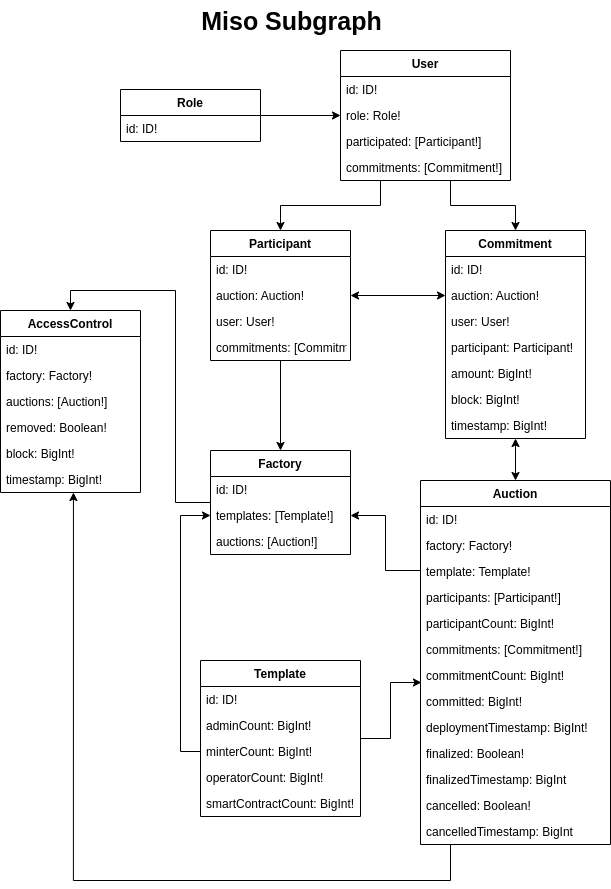

# Miso Subgraph





# Unit testing

## Run
```
yarn graph test -r

yarn graph test -r <ONE-OR-MORE-TEST-NAMES>
```
NOTE:  
The `-r` flag is short for `--recompile`. The default behavior of matchstick used to be to recompile every time and is now changed to only recompile on changes made to a test file, therefore it's a safer bet to always use it for the time being.
